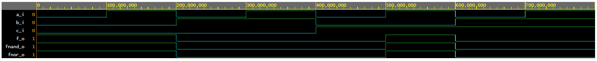
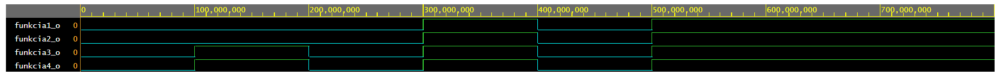

```diff
-Lab- 1 (Baláž 222727)
```

## 1. De Morganove zákony ##

### Odkaz na eda playground ### 
[DeMorgan](https://www.edaplayground.com/x/gujC)




| **c** | **b** |**a** | **f(c,b,a)** |
| :-: | :-: | :-: | :-: |
| 0 | 0 | 0 | 1 |
| 0 | 0 | 1 | 1 |
| 0 | 1 | 0 | 0 |
| 0 | 1 | 1 | 0 |
| 1 | 0 | 0 | 0 |
| 1 | 0 | 1 | 1 |
| 1 | 1 | 0 | 0 |
| 1 | 1 | 1 | 0 |


**1.Funkcia**

```vhdl
architecture dataflow of gates is
begin
    f_o    <= ((not b_i) and a_i) or ((not c_i) and (not b_i));
end architecture dataflow;
```

**2.Funkcia NAND**

```vhdl
architecture dataflow of gates is
begin
     fnand_o <= not (not (not b_i and a_i) and not(not c_i and not b_i));
end architecture dataflow;
```

**3.Funkcia NOR**

```vhdl
architecture dataflow of gates is
begin
    fnor_o  <= not(b_i or not a_i) or not (c_i or b_i);
end architecture dataflow;
```
## 2. Distribučné zákony ##
### Odkaz na eda playground ### 
[Distribucne](https://www.edaplayground.com/x/kuqx)




| **c** | **b** |**a** | **f(c,b,a)** |
| :-: | :-: | :-: | :-: |
| 0 | 0 | 0 | 1 |
| 0 | 0 | 1 | 1 |
| 0 | 1 | 0 | 0 |
| 0 | 1 | 1 | 0 |
| 1 | 0 | 0 | 0 |
| 1 | 0 | 1 | 1 |
| 1 | 1 | 0 | 0 |
| 1 | 1 | 1 | 0 |

**Distribucne zakony**
```vhdl
architecture dataflow of gates is
begin
    funkcia1_o <= ((x_i and y_i) or (x_i and z_i));
    funkcia2_o <= (x_i and (y_i or z_i));
    funkcia3_o <= ((x_i or y_i) and (x_i or z_i));
    funkcia4_o <= (x_i or (y_i and z_i));
end architecture dataflow;
```


