```diff
-Lab- 3 (Baláž 222727)
```

## Nexys A7 board - Prepojenia (Prepínače a Ledky)

| **LED** | **Connection** | **Switch** | **Connection** |
| :-: | :-: | :-: | :-: |
| LED0 | H17 | SW0 | J15 |
| LED1 | K15 | SW1 | L16 |
| LED2 | J13 | SW2 | M13 |
| LED3 | N14 | SW3 | R15 |
| LED4 | R18 | SW4 | R17 |
| LED5 | V17 | SW5 | T18 |
| LED6 | U17 | SW6 | U18 |
| LED7 | U16 | SW7 | R13 |
| LED8 | V16 | SW8 | T8 |
| LED9 | T15 | SW9 | U8 |
| LED10 | U14 | SW10 | R16 |
| LED11 | T16 | SW11 | T13 |
| LED12 | V15 | SW12 | H6 |
| LED13 | V14 | SW13 | U12 |
| LED14 | V12 | SW14 | U11 |
| LED15 | V11 | SW15 | V10 |

## Two-bit wide 4-to-1 multiplexer

### VDHL design

```vhdl
library ieee;
use ieee.std_logic_1164.all;

------------------------------------------------------------------------
-- Entity declaration for 2-bit binary comparator
------------------------------------------------------------------------
entity mux_2bit_4to1 is
    port(
        a_i           : in  std_logic_vector(2 - 1 downto 0);
        b_i           : in  std_logic_vector(2 - 1 downto 0);
        c_i           : in  std_logic_vector(2 - 1 downto 0);
        d_i           : in  std_logic_vector(2 - 1 downto 0);
        sel_i         : in  std_logic_vector(2 - 1 downto 0);
      
        f_o           : out std_logic_vector(2 - 1 downto 0)      
    );
end entity mux_2bit_4to1;

------------------------------------------------------------------------
-- Architecture body for 2-bit binary comparator
------------------------------------------------------------------------
architecture Behavioral of mux_2bit_4to1 is
begin
    
    f_o <= a_i when (sel_i = "00") else
           b_i when (sel_i = "01") else
           c_i when (sel_i = "10") else
           d_i;
           
end architecture Behavioral;
```
### VDHL testbench
```vhdl
library ieee;
use ieee.std_logic_1164.all;


entity tb_comparator_2bit is
   
end entity tb_comparator_2bit;

------------------------------------------------------------------------
-- Architecture body for testbench
------------------------------------------------------------------------
architecture testbench of tb_comparator_2bit is

    -- Local signals
    signal s_a       : std_logic_vector(2 - 1 downto 0);
    signal s_b       : std_logic_vector(2 - 1 downto 0);
    signal s_c       : std_logic_vector(2 - 1 downto 0);
    signal s_d       : std_logic_vector(2 - 1 downto 0);
    signal s_sel    : std_logic_vector(2 - 1 downto 0);
    signal s_f       : std_logic_vector(2 - 1 downto 0);

begin

    uut_comparator_2bit : entity work.mux_2bit_4to1
        port map(
            a_i           => s_a,
            b_i           => s_b,
            c_i           => s_c,
            d_i           => s_d,
            sel_i         => s_sel,
            f_o           => s_f
 
        );

    p_stimulus : process
    begin

        report "Stimulus process started" severity note;

        s_d <= "00"; s_c <= "00"; s_b <= "00"; s_a  <= "00"; 
        s_sel <="00"; wait for 100ns;
        
        s_a   <= "01"; wait for 100ns;
        s_b   <= "01"; wait for 100ns;
        
        s_sel <= "01"; wait for 100ns;
        s_c   <= "00"; wait for 100ns;
        s_b   <= "11"; wait for 100ns;
        
        s_d   <= "00"; s_c <= "11"; s_b <= "01"; s_a <= "00";
        s_sel <= "10"; wait for 100ns;
        
        s_d   <= "00"; s_c <= "00"; s_b <= "01"; s_a <= "00";
        s_sel <= "10"; wait for 100ns;
        
        s_d   <= "10"; s_c <= "11"; s_b <= "01"; s_a <= "00";
        s_sel <= "11"; wait for 100ns;

        report "Stimulus process finished" severity note;
        wait;
    end process p_stimulus;

end architecture testbench;
```
## Simulácia
### Default 

### Binary
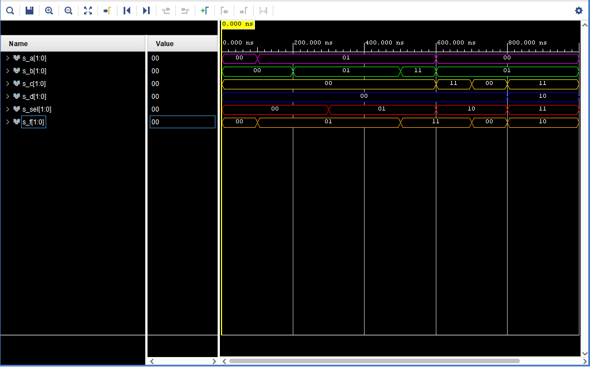
## Vivado Tutoriál
#### Spustíme  aplikáciu Vivado 


#### Vytvoríme projekt

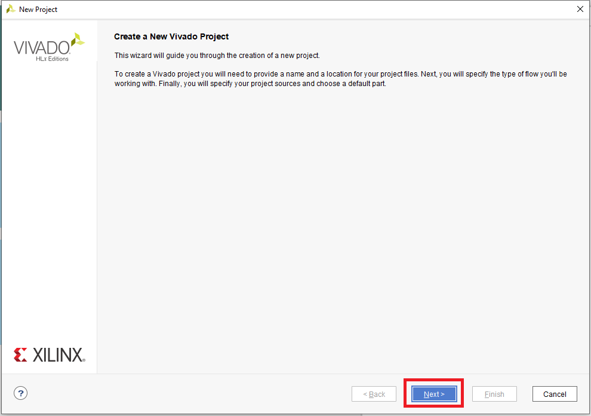
#### Vytvoríme meno projektu a miesto kde sa nám bude projekt ukladať
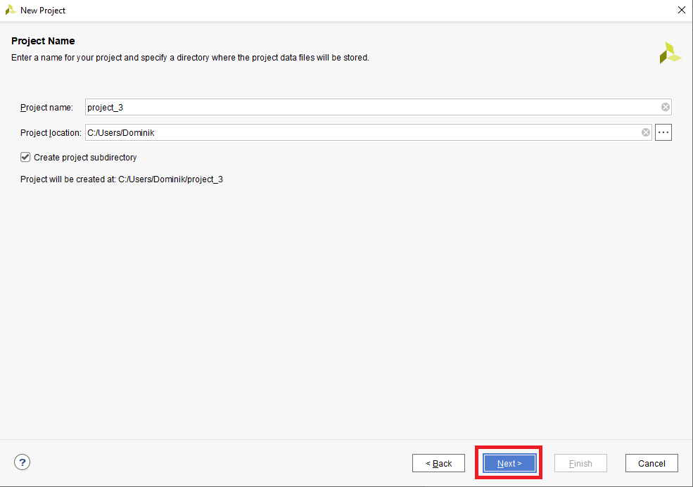
#### Zaškrtneme RTL Project
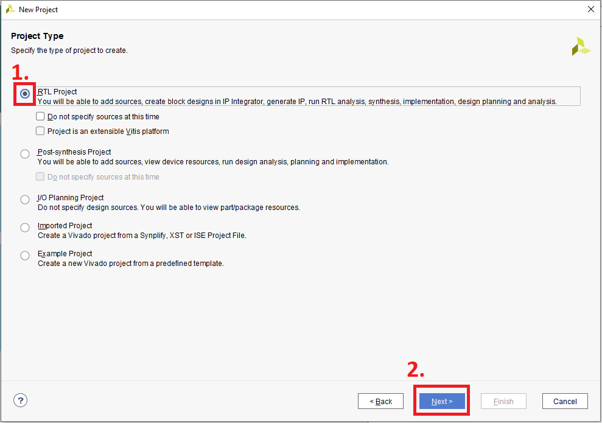
#### Target language a Simulator language zmeníme na "VHDL" a klikneme "Next"
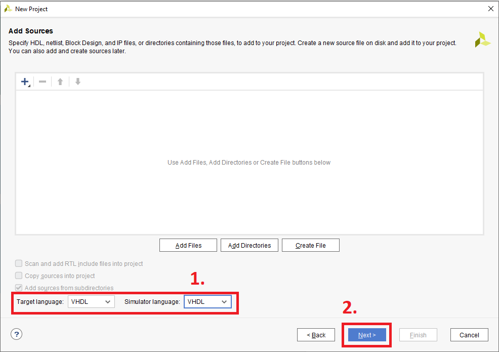

#### Klikneme na "Boards" v Search vyhľadáme "Nexys A7" a zvolíme "Nexys A7-50T" následne "Next"
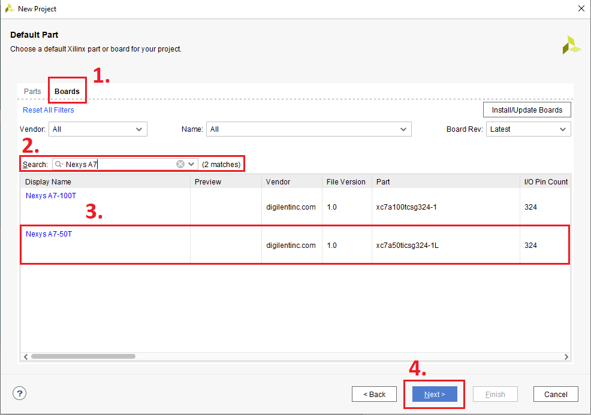
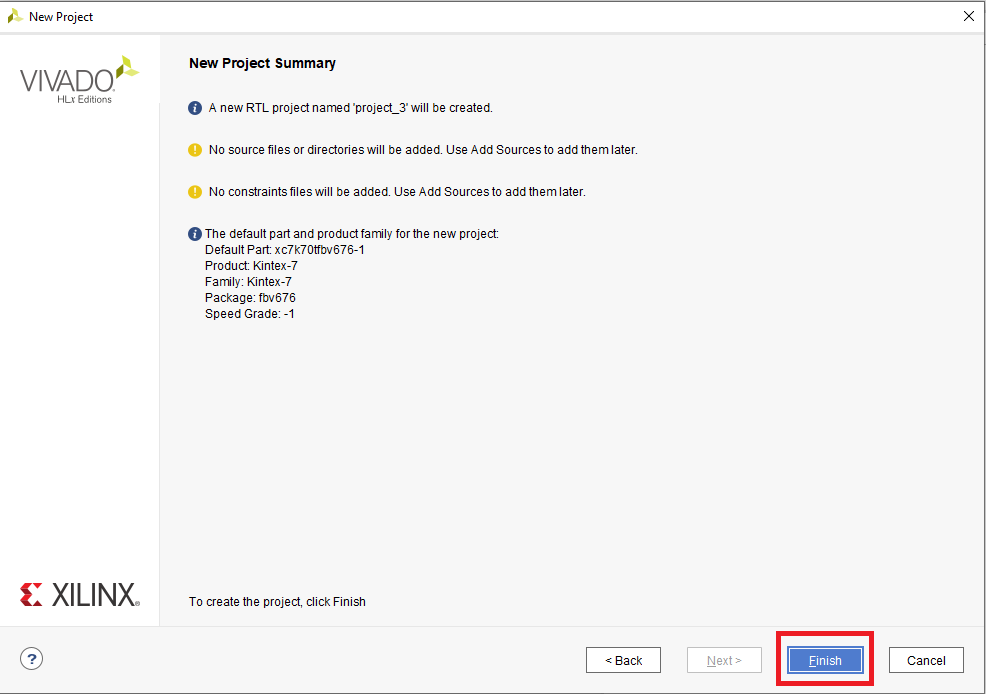
#### Klikneme na "File" --> "Add Sources" alebo klávesovú skratku "Alt+A"

#### Podľa toho aký zdroj chceme vytvoriť tak zvolíme v našom prípade "design sources" a následne "next"
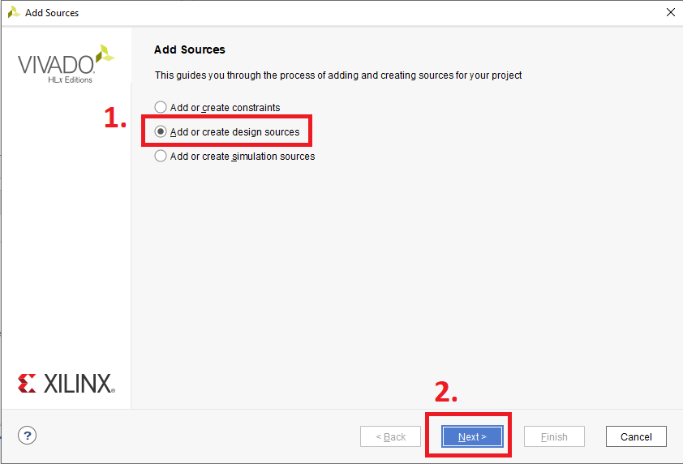
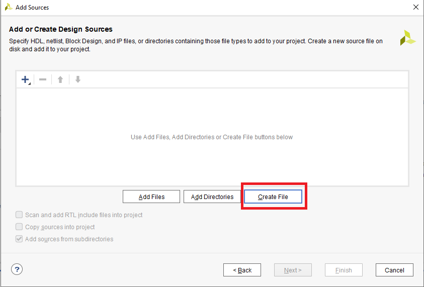
#### File type "VHDL" následne vytvoríme meno vo "File Name" a dáme "OK"
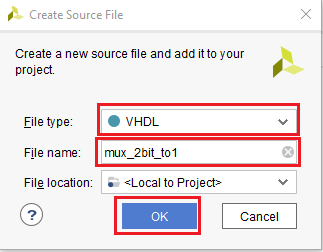
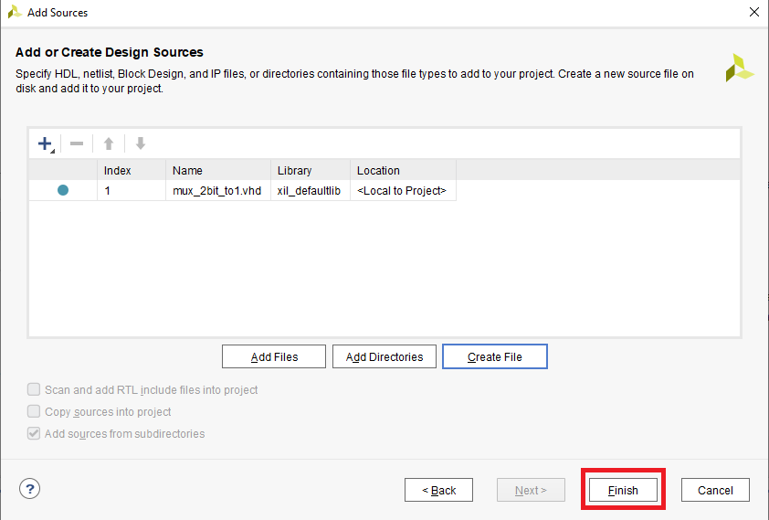

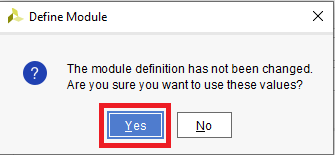
#### Rovnaký postup použijeme aj pri iných zdrojoch "constraints alebo simulation sources"

#### Spustenie simulácie:  "Flow" --> "Run Simulation" --> "Run Behavioral Simulation"
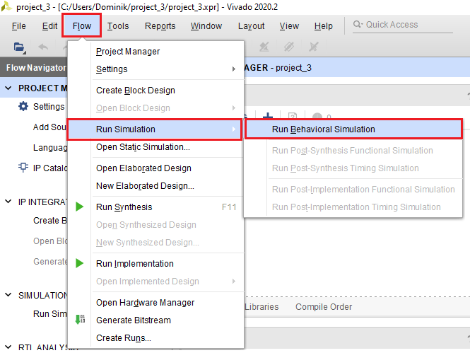