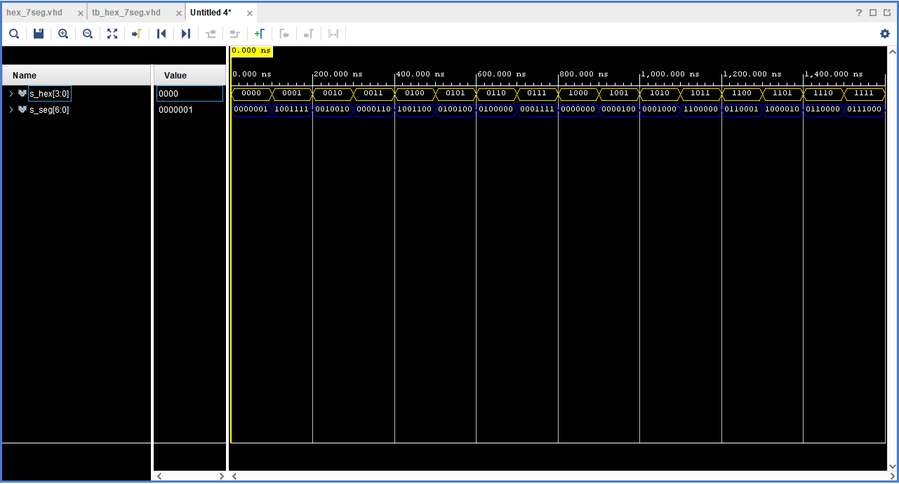
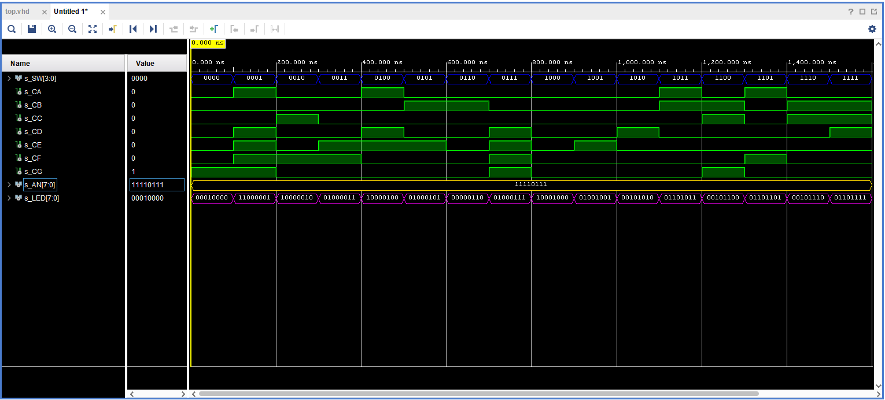

```diff
-Lab- 4 (Baláž 222727)
```

## Pravdivostná tabuľka dekódera  pre bežné anódové 7  segmentové zobrazenie

| **Hex** | **Inputs** | **A** | **B** | **C** | **D** | **E** | **F** | **G** |
| :-: | :-: | :-: | :-: | :-: | :-: | :-: | :-: | :-: |
| 0 | 0000 | 0 | 0 | 0 | 0 | 0 | 0 | 1 |
| 1 | 0001 | 1 | 0 | 0 | 1 | 1 | 1 | 1 |
| 2 | 0010 | 0 | 0 | 1 | 0 | 0 | 1 | 0 |
| 3 | 0011 | 0 | 0 | 0 | 0 | 1 | 1 | 0 |
| 4 | 0100 | 1 | 0 | 0 | 1 | 1 | 0 | 0 |
| 5 | 0101 | 0 | 1 | 0 | 0 | 1 | 0 | 0 |
| 6 | 0110 | 0 | 1 | 0 | 0 | 0 | 0 | 0 |
| 7 | 0111 | 0 | 0 | 1 | 1 | 1 | 1 | 1 |
| 8 | 1000 | 0 | 0 | 0 | 0 | 0 | 0 | 0 |
| 9 | 1001 | 0 | 0 | 0 | 0 | 1 | 0 | 0 |
| A | 1010 | 0 | 0 | 0 | 1 | 0 | 0 | 0 |
| b | 1011 | 1 | 1 | 0 | 0 | 0 | 0 | 0 |
| C | 1100 | 0 | 1 | 1 | 0 | 0 | 0 | 1 |
| d | 1101 | 1 | 0 | 0 | 0 | 0 | 1 | 0 |
| E | 1110 | 0 | 1 | 1 | 0 | 0 | 0 | 0 |
| F | 1111 | 0 | 1 | 1 | 1 | 0 | 0 | 0 |


## VHDL kód- dekóder
```vhdl
entity hex_7seg is
    Port ( hex_i : in STD_LOGIC_VECTOR (3 downto 0);
           seg_o : out STD_LOGIC_VECTOR (6 downto 0));
end hex_7seg;
architecture Behavioral of hex_7seg is
begin
-- WRITE YOUR CODE HERE
            --  0, 1, 2, 3, 4, 5, 6, 7, 8, 9
    p_7seg_decoder : process(hex_i)
    begin
        case hex_i is
            when "0000" =>
                seg_o <= "0000001";     -- 0
            when "0001" =>
                seg_o <= "1001111";     -- 1
            when "0010" =>
                seg_o <= "0010010";     -- 2
            when "0011" =>
                seg_o <= "0000110";     -- 3
            when "0100" =>
                seg_o <= "1001100";     -- 4
            when "0101" =>
                seg_o <= "0100100";     -- 5
            when "0110" =>
                seg_o <= "0100000";     -- 6
            when "0111" =>
                seg_o <= "0001111";     -- 7
            when "1000" =>
                seg_o <= "0000000";     -- 8
            when "1001" =>
                seg_o <= "0000100";     -- 9

            -- WRITE YOUR CODE HERE
            -- A, b, C, d , E , F 

            when "1010" =>
                seg_o <= "0001000";     -- A
            when "1011" =>
                seg_o <= "1100000";     -- b
            when "1100" =>
                seg_o <= "0110001";     -- C
            when "1101" =>
                seg_o <= "1000010";     -- d
            when "1110" =>
                seg_o <= "0110000";     -- E
            when others =>
                seg_o <= "0111000";     -- F
        end case;
    end process p_7seg_decoder;

end architecture Behavioral;
```
## VHDL kód- testbench
```vhdl
architecture testbench of tb_hex_7seg is

    -- Local signals
    signal s_hex       : std_logic_vector(3 downto 0);
    signal s_seg       : std_logic_vector(6 downto 0);

begin

    uut_hex_7seg : entity work.hex_7seg
        port map(
            hex_i         => s_hex,
            seg_o         =>  s_seg
            
        );

    p_stimulus : process
    begin

        report "Stimulus process started" severity note;

        s_hex<="0000"; wait for 100 ns;
        s_hex<="0001"; wait for 100 ns;
        s_hex<="0010"; wait for 100 ns;
        s_hex<="0011"; wait for 100 ns;
        s_hex<="0100"; wait for 100 ns;
        s_hex<="0101"; wait for 100 ns;
        s_hex<="0110"; wait for 100 ns;
        s_hex<="0111"; wait for 100 ns;
        s_hex<="1000"; wait for 100 ns;
        s_hex<="1001"; wait for 100 ns;
        s_hex<="1010"; wait for 100 ns;
        s_hex<="1011"; wait for 100 ns;
        s_hex<="1100"; wait for 100 ns;
        s_hex<="1101"; wait for 100 ns;
        s_hex<="1110"; wait for 100 ns;
        s_hex<="1111"; wait;

    end process p_stimulus;

end architecture testbench;
```


## LED pravdivostná tabuľka

| **Hex** | **Inputs** | **LED4** | **LED5** | **LED6** | **LED7** |
| :-: | :-: | :-: | :-: | :-: | :-: |
| 0 | 0000 | 1 | 0 | 0 | 0 |
| 1 | 0001 | 0 | 0 | 1 | 1 |
| 2 | 0010 | 0 | 0 | 0 | 1 |
| 3 | 0011 | 0 | 0 | 1 | 0 |
| 4 | 0100 | 0 | 0 | 0 | 1 |
| 5 | 0101 | 0 | 0 | 1 | 0 |
| 6 | 0110 | 0 | 0 | 0 | 0 |
| 7 | 0111 | 0 | 0 | 1 | 0 |
| 8 | 1000 | 0 | 0 | 0 | 1 |
| 9 | 1001 | 0 | 0 | 1 | 0 |
| A | 1010 | 0 | 1 | 0 | 0 |
| b | 1011 | 0 | 1 | 1 | 0 |
| C | 1100 | 0 | 1 | 0 | 0 |
| d | 1101 | 0 | 1 | 1 | 0 |
| E | 1110 | 0 | 1 | 0 | 0 |
| F | 1111 | 0 | 1 | 1 | 1 |

## VHDL kód- top

```vhdl
library IEEE;
use IEEE.STD_LOGIC_1164.ALL;

-- Uncomment the following library declaration if using
-- arithmetic functions with Signed or Unsigned values
use IEEE.NUMERIC_STD.ALL;

-- Uncomment the following library declaration if instantiating
-- any Xilinx leaf cells in this code.
--library UNISIM;
--use UNISIM.VComponents.all;

entity top is
    Port ( SW : in STD_LOGIC_VECTOR (3 downto 0);
           CA : out STD_LOGIC;
           CB : out STD_LOGIC;
           CC : out STD_LOGIC;
           CD : out STD_LOGIC;
           CE : out STD_LOGIC;
           CF : out STD_LOGIC;
           CG : out STD_LOGIC;
           AN : out STD_LOGIC_VECTOR (7 downto 0);
           LED : out STD_LOGIC_VECTOR (7 downto 0));
end top;

------------------------------------------------------------------------
-- Architecture body for top level
------------------------------------------------------------------------
architecture Behavioral of top is
begin

    --------------------------------------------------------------------
    -- Instance (copy) of hex_7seg entity
    hex2seg : entity work.hex_7seg
        port map(
            hex_i    => SW,
            seg_o(6) => CA,
            seg_o(5) => CB,
            seg_o(4) => CC,
            seg_o(3) => CD,
            seg_o(2) => CE,
            seg_o(1) => CF,
            seg_o(0) => CG
        );

    -- Connect one common anode to 3.3V
    AN <= b"1111_0111";

    -- Display input value on LEDs
    LED(3 downto 0) <= SW;


    -- LED(7:4) indicators
    -- Turn LED(4) on if input value is equal to 0, ie "0000"
   LED(4)<='1' when (SW="0000") else '0';

    -- Turn LED(5) on if input value is greater than "1001", ie 9
     LED(5)<='1' when (SW>"1001") else '0';
    
    -- Turn LED(6) on if input value is odd, ie 1, 3, 5, ...
      LED (6) <= '1' when (unsigned(SW) mod 2=1) else '0';
    
    -- Turn LED(7) on if input value is a power of two, ie 1, 2, 4, or 8
    LED (7) <= '1' when (SW = "0001" or SW = "0010" or SW = "0100" or SW = "1000") else '0';

end architecture Behavioral;
```
## VHDL kód- top testbench
```vhdl
library ieee;
use ieee.std_logic_1164.all;


entity tb_top is
   
end entity tb_top;

------------------------------------------------------------------------
-- Architecture body for testbench
------------------------------------------------------------------------
architecture testbench of tb_top is

    -- Local signals
    signal s_SW      : std_logic_vector(3 downto 0);
    signal s_CA      : std_logic;
    signal s_CB      : std_logic;
    signal s_CC      : std_logic;
    signal s_CD      : std_logic;
    signal s_CE      : std_logic;
    signal s_CF      : std_logic;
    signal s_CG      : std_logic;
    signal s_AN      : std_logic_vector(7 downto 0);
    signal s_LED     : std_logic_vector(7 downto 0);
       
begin

    uut_top : entity work.top
        port map(
           SW => s_SW,
           CA => s_CA,
           CB => s_CB,
           CC => s_CC,
           CD => s_CD,
           CE=> s_CE,
           CF => s_CF,
           CG => s_CG,
           AN => s_AN,
           LED => s_LED
           
        );

    p_stimulus : process
    begin

        report "Stimulus process started" severity note;

        s_SW<="0000"; wait for 100 ns;
        s_SW<="0001"; wait for 100 ns;
        s_SW<="0010"; wait for 100 ns;
        s_SW<="0011"; wait for 100 ns;
        s_SW<="0100"; wait for 100 ns;
        s_SW<="0101"; wait for 100 ns;
        s_SW<="0110"; wait for 100 ns;
        s_SW<="0111"; wait for 100 ns;
        s_SW<="1000"; wait for 100 ns;
        s_SW<="1001"; wait for 100 ns;
        s_SW<="1010"; wait for 100 ns;
        s_SW<="1011"; wait for 100 ns;
        s_SW<="1100"; wait for 100 ns;
        s_SW<="1101"; wait for 100 ns;
        s_SW<="1110"; wait for 100 ns;
        s_SW<="1111"; wait;


    end process p_stimulus;

end architecture testbench;
```
