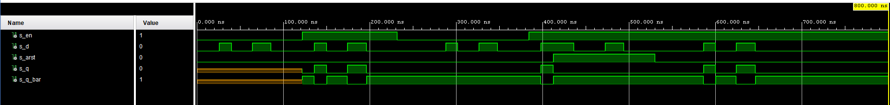
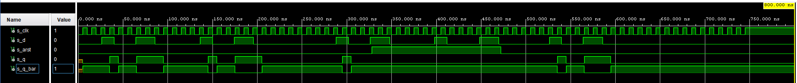
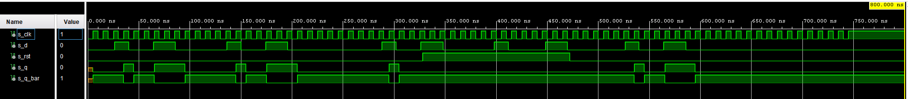
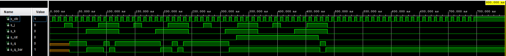
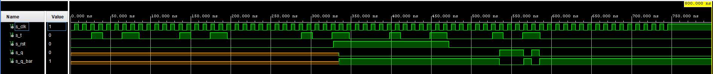
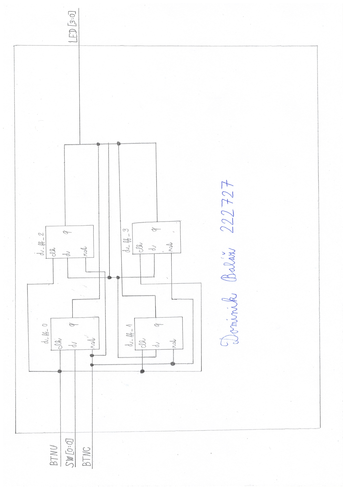

```diff
-Lab- 7 (Baláž 222727)
```


## Preparation tasks (done before the lab at home)
```vhdl
flip-flop d: q_(n+1) = d
```
| **d** | **q(n)** | **q(n+1)** | **Comments** |
| :-: | :-: | :-: | :-- |
| 0 | 0 | 0 | No change |
| 0 | 1 | 0 | Change |
| 1 | 1 | 1 | No change |
| 1 | 0 | 1 | Change |

```vhdl
flip-flop j: q_(n+1) = j * (not q_n) + (not k) * (q_n)
```
| **j** | **k** | **q(n)** | **q(n+1)** | **Comments** |
| :-: | :-: | :-: | :-: | :-- |
| 0 | 0 | 0 | 0 | No change |
| 0 | 0 | 1 | 1 | No change |
| 0 | 1 | 1 | 0 | Reset |
| 0 | 1 | 0 | 0 | Reset |
| 1 | 0 | 1 | 1 | Set |
| 1 | 0 | 0 | 1 | Set |
| 1 | 1 | 1 | 0 | Toggle |
| 1 | 1 | 0 | 1 | Toggle |

```vhdl
flip-flop t: q_(n+1) = t * (not q_n) + (not t) * (q_n)
```
| **t** | **q(n)** | **q(n+1)** | **Comments** |
| :-: | :-: | :-: | :-- |
| 0 | 0 | 0 | No change |
| 0 | 1 | 1 | No change |
| 1 | 1 | 0 | Toggle |
| 1 | 0 | 1 | Toggle |


## d_latch (VHDL source)
```vhdl
library IEEE;
use IEEE.STD_LOGIC_1164.ALL;

   entity d_latch is
    Port ( en :      in STD_LOGIC;
           arst :    in STD_LOGIC;
           d :       in STD_LOGIC;
           q :       out STD_LOGIC;
           q_bar :   out STD_LOGIC
           );
end d_latch;

architecture Behavioral of d_latch is
begin
     p_d_latch :process (en,d,arst)
     begin
       if (arst ='1') then
          q     <= '0';
          q_bar <= '1';
          
       elsif (en = '1') then
          q     <= d;
          q_bar <= not d;
       end if;
     end process p_d_latch;
     
end Behavioral;
```


## tb_d_latch (VHDL testbench)
```vhdl
library IEEE;
use IEEE.STD_LOGIC_1164.ALL;

entity tb_d_latch is
--  Port ( );
end tb_d_latch;

architecture testbench of tb_d_latch is
signal s_en    :  STD_LOGIC;  
signal s_d     :  STD_LOGIC;  
signal s_arst  :  STD_LOGIC;  
signal s_q     :  STD_LOGIC; 
signal s_q_bar :  STD_LOGIC;

begin
uut_d_latch : entity work.d_latch
port map (
en       => s_en,
d        => s_d,
arst     => s_arst,
q        => s_q,
q_bar    => s_q_bar

);

      p_d_latch :process
      begin
          report "Stimulus process started" severity note;

          s_en   <= '0'; 
          s_d    <= '0';
          s_arst <= '0';
          wait for 26 ns;

          s_d    <= '1'; 
          wait for 14 ns;
          s_d    <= '0';
          wait for 24 ns;
          s_d    <= '1';
          wait for 22 ns;
          s_d    <= '0';
          wait for 36 ns;

         
          s_en <= '1';    -- Test Enable activated 
          wait for 14 ns;
          s_d  <= '1';
          wait for 14 ns;
          s_d  <= '0';
          wait for 24 ns;
          s_d  <= '1';
          wait for 22 ns;
          s_d  <= '0';
          wait for 36 ns;
          s_en <= '0';    -- Enable deactivated 
          wait for 56 ns;

          s_d    <= '1'; 
          wait for 14 ns;
          s_d    <= '0'; 
          wait for 24 ns;
          s_d    <= '1'; 
          wait for 22 ns;
          s_d    <= '0'; 
          wait for 36 ns;

        
          s_en   <= '1';
          wait for 14 ns;
          s_d    <= '1';
          wait for 14 ns;
          s_arst <= '1';   -- Test Reset activated
          wait for 24 ns;
          s_d    <= '0';
          wait for 36 ns;
          s_d  <= '1';
          wait for 22 ns;
          s_d <= '0';
          wait for 36 ns;
          s_arst <= '0';   -- Reset deactivated
          wait for 56 ns;
          s_d <= '1';
          wait for 14 ns;
          s_d <= '0';
          wait for 24 ns;
          s_d <= '1';
          wait for 22 ns;
          s_d <= '0';
          wait for 36  ns;

         report "Stimulus process finished" severity note;
          wait;
       end process p_d_latch;      
end testbench;
```
## Simulation 


## d_ff_arst (VHDL source)
```vhdl
library IEEE;
use IEEE.STD_LOGIC_1164.ALL;

entity d_ff_arst is
    Port ( clk :   in STD_LOGIC;
           arst :  in STD_LOGIC;
           d :     in STD_LOGIC;
           q :     out STD_LOGIC;
           q_bar : out STD_LOGIC);
end d_ff_arst;

architecture Behavioral of d_ff_arst is

signal s_q :STD_LOGIC;
       signal s_q_bar :STD_LOGIC;
begin
  p_d_ff_arst :process (clk,arst)
     begin
       if (arst = '1') then
          s_q     <= '0';
          s_q_bar <= '1';
          
       elsif rising_edge (clk) then
          s_q     <= d;
          s_q_bar <= not d;
       end if;
     end process p_d_ff_arst;
     q     <= s_q;
     q_bar <= s_q_bar;
end Behavioral;
```
## tb_d_ff_arst (VHDL testbench)
```vhdl
library IEEE;
use IEEE.STD_LOGIC_1164.ALL;

entity tb_d_ff_arst is
--  Port ( );
end tb_d_ff_arst;

architecture Behavioral of tb_d_ff_arst is

-- Local constants
     constant c_CLK_100MHZ_PERIOD : time    := 10 ns;
    
     -- Local signals
     signal s_clk   :  STD_LOGIC;  
     signal s_d     :  STD_LOGIC;  
     signal s_arst  :  STD_LOGIC;  
     signal s_q     :  STD_LOGIC; 
     signal s_q_bar :  STD_LOGIC;

  begin
     uut_d_ff_arst : entity work.d_ff_arst
      port map (
         clk       => s_clk,
         d         => s_d,
         arst      => s_arst,
         q         => s_q,
         q_bar     => s_q_bar
);

    --------------------------------------------------------------------
    -- Clock generation process
    --------------------------------------------------------------------
    
      p_clk_gen : process
      begin 
         while now < 750ns loop         -- 75 periods of 100MHz clock
            s_clk <= '0';
            wait for c_CLK_100MHZ_PERIOD / 2;
            s_clk <= '1';
            wait for c_CLK_100MHZ_PERIOD / 2;
        end loop;
        wait;
      end process p_clk_gen;

    --------------------------------------------------------------------
    -- Reset generation process
    --------------------------------------------------------------------
      p_reset_gen : process
      begin
           s_arst <= '0';
           wait for 328 ns;
        
        -- Reset activated
           s_arst <= '1';
           wait for 144 ns;

        -- Reset deactivated
           s_arst <= '0';

           wait;
       end process p_reset_gen;
    
      p_d_ff_arst :process
      begin
          report "Stimulus process started" severity note;

          s_d    <= '0';
          wait for 26 ns;

          s_d    <= '1'; 
          wait for 14 ns;
          s_d    <= '0';
          wait for 24 ns;
          s_d    <= '1';
          wait for 22 ns;
          s_d    <= '0';
          wait for 36 ns;

          -- Test enable
          wait for 14 ns;
          s_d  <= '1';
          wait for 14 ns;
          s_d  <= '0';
          wait for 24 ns;
          s_d  <= '1';
          wait for 22 ns;
          s_d  <= '0';
          wait for 36 ns;
          wait for 56 ns;

          s_d    <= '1'; 
          wait for 14 ns;
          s_d    <= '0'; 
          wait for 24 ns;
          s_d    <= '1'; 
          wait for 22 ns;
          s_d    <= '0'; 
          wait for 36 ns;

          -- Test reset
          wait for 14 ns;
          s_d    <= '1';
          wait for 14 ns;
          s_d    <= '0';
          wait for 36 ns;
          s_d  <= '1';
          wait for 22 ns;
          s_d <= '0';
          wait for 56 ns;
          s_d <= '1';
          wait for 14 ns;
          s_d <= '0';
          wait for 24 ns;
          s_d <= '1';
          wait for 22 ns;
          s_d <= '0';
          wait for 36  ns;
           
           report "Stimulus process finished" severity note;
           wait;

        end process p_d_ff_arst;
end Behavioral;
```
## Simulation 

## d_ff_rst (VHDL source)
```vhdl
library IEEE;
use IEEE.STD_LOGIC_1164.ALL;

entity d_ff_rst is
    Port ( clk : in STD_LOGIC;
           rst : in STD_LOGIC;
           d : in STD_LOGIC;
           q : out STD_LOGIC;
           q_bar : out STD_LOGIC);
end d_ff_rst;

architecture Behavioral of d_ff_rst is
     signal s_q :STD_LOGIC;
     signal s_q_bar :STD_LOGIC;
begin
p_d_ff_rst :process (clk)
    begin
       if rising_edge (clk) then
         if(rst = '1') then 
           s_q     <= '0';
           s_q_bar <= '1'; 
       else
           s_q     <= d;    
           s_q_bar <= not d;
   
                    end if;
       end if;
     end process p_d_ff_rst;
```
## tb_d_ff_rst (VHDL testbench)
```vhdl
library IEEE;
use IEEE.STD_LOGIC_1164.ALL;

entity tb_d_ff_rst is
--  Port ( );
end tb_d_ff_rst;

architecture Behavioral of tb_d_ff_rst is

-- Local constants
     constant c_CLK_100MHZ_PERIOD : time    := 10 ns;
    
     -- Local signals
     signal s_clk   :  STD_LOGIC;  
     signal s_d     :  STD_LOGIC;  
     signal s_rst  :  STD_LOGIC;  
     signal s_q     :  STD_LOGIC; 
     signal s_q_bar :  STD_LOGIC;

  begin
     uut_d_ff_rst : entity work.d_ff_rst
      port map (
         clk       => s_clk,
         d         => s_d,
         rst       => s_rst,
         q         => s_q,
         q_bar     => s_q_bar
);

    --------------------------------------------------------------------
    -- Clock generation process
    --------------------------------------------------------------------
    
      p_clk_gen : process
      begin 
         while now < 750ns loop         -- 75 periods of 100MHz clock
            s_clk <= '0';
            wait for c_CLK_100MHZ_PERIOD / 2;
            s_clk <= '1';
            wait for c_CLK_100MHZ_PERIOD / 2;
        end loop;
        wait;
      end process p_clk_gen;

    --------------------------------------------------------------------
    -- Reset generation process
    --------------------------------------------------------------------
      p_reset_gen : process
      begin
           s_rst <= '0';
           wait for 328 ns;
        
        -- Reset activated
           s_rst <= '1';
           wait for 144 ns;

        -- Reset deactivated
           s_rst <= '0';

           wait;
       end process p_reset_gen;
    
      p_d_ff_rst :process
      begin
          report "Stimulus process started" severity note;

          s_d    <= '0';
          wait for 26 ns;

          s_d    <= '1'; 
          wait for 14 ns;
          s_d    <= '0';
          wait for 24 ns;
          s_d    <= '1';
          wait for 22 ns;
          s_d    <= '0';
          wait for 36 ns;

          -- Test enable
          wait for 14 ns;
          s_d  <= '1';
          wait for 14 ns;
          s_d  <= '0';
          wait for 24 ns;
          s_d  <= '1';
          wait for 22 ns;
          s_d  <= '0';
          wait for 36 ns;
          wait for 56 ns;

          s_d    <= '1'; 
          wait for 14 ns;
          s_d    <= '0'; 
          wait for 24 ns;
          s_d    <= '1'; 
          wait for 22 ns;
          s_d    <= '0'; 
          wait for 36 ns;

          -- Test reset
          wait for 14 ns;
          s_d    <= '1';
          wait for 14 ns;
          s_d    <= '0';
          wait for 36 ns;
          s_d  <= '1';
          wait for 22 ns;
          s_d <= '0';
          wait for 56 ns;
          s_d <= '1';
          wait for 14 ns;
          s_d <= '0';
          wait for 24 ns;
          s_d <= '1';
          wait for 22 ns;
          s_d <= '0';
          wait for 36  ns;
           
           report "Stimulus process finished" severity note;
           wait;

        end process p_d_ff_rst;
end Behavioral;
```
## Simulation 


## jk_ff_rst (VHDL source)
```vhdl
library IEEE;
use IEEE.STD_LOGIC_1164.ALL;

entity jk_ff_rst is
    Port ( clk : in STD_LOGIC;
           rst : in STD_LOGIC;
           j : in STD_LOGIC;
           k : in STD_LOGIC;
           q : out STD_LOGIC;
           q_bar : out STD_LOGIC);
end jk_ff_rst;

architecture Behavioral of jk_ff_rst is

begin
  p_jk_ff_rst :process (clk)
  variable qn : std_logic;
    begin
       if rising_edge (clk) then
         if(rst = '1') then 
           qn := '0';
      else
       if (j ='0' and k= '0') then
           qn := qn;
       elsif (j ='0' and k= '1') then
           qn := '0';
       elsif (j ='1' and k= '0') then
           qn := '1';
       else
           qn := not qn;
         end if;
       end if;
     end if;
     q     <= qn;
     q_bar <= not qn;
     end process p_jk_ff_rst;
   
end Behavioral;
```
## tb_jk_ff_rst (VHDL testbench)
```vhdl
library IEEE;
use IEEE.STD_LOGIC_1164.ALL;

entity tb_jk_ff_rst is
--  Port ( );
end tb_jk_ff_rst;

architecture Behavioral of tb_jk_ff_rst is

 -- Local constants
     constant c_CLK_100MHZ_PERIOD : time    := 10 ns;
    
     -- Local signals
     signal s_clk   :  STD_LOGIC;  
     signal s_j     :  STD_LOGIC;  
     signal s_k     :  STD_LOGIC;  
     signal s_rst   :  STD_LOGIC;  
     signal s_q     :  STD_LOGIC; 
     signal s_q_bar :  STD_LOGIC;

  begin
     uut_jk_ff_rst : entity work.jk_ff_rst
      port map (
         clk       => s_clk,
         j         => s_j,
         k         => s_k,
         rst       => s_rst,
         q         => s_q,
         q_bar     => s_q_bar
);

    --------------------------------------------------------------------
    -- Clock generation process
    --------------------------------------------------------------------
    
      p_clk_gen : process
      begin 
         while now < 750ns loop         -- 75 periods of 100MHz clock
            s_clk <= '0';
            wait for c_CLK_100MHZ_PERIOD / 2;
            s_clk <= '1';
            wait for c_CLK_100MHZ_PERIOD / 2;
        end loop;
        wait;
      end process p_clk_gen;

    --------------------------------------------------------------------
    -- Reset generation process
    --------------------------------------------------------------------
      p_reset_gen : process
      begin
           s_rst <= '0';
           wait for 328 ns;
        
        -- Reset activated
           s_rst <= '1';
           wait for 144 ns;

        -- Reset deactivated
           s_rst <= '0';

           wait;
       end process p_reset_gen;
    
      p_jk_ff_rst :process
      begin
          report "Stimulus process started" severity note;
          s_j    <= '0';
          s_k    <= '0';
          wait for 26 ns;
          
          s_j    <= '1'; 
          s_k    <= '0';
          wait for 14 ns;
          s_j    <= '0';
          s_k    <= '0';
          wait for 24 ns;
          s_j    <= '0';
          s_k    <= '1';
          wait for 22 ns;
          s_j    <= '1';
          s_k    <= '1';
          wait for 36 ns;
          s_j    <= '0';
          s_k    <= '0';
          wait for 26 ns;
          
          s_j    <= '1'; 
          s_k    <= '0';
          wait for 14 ns;
          s_j    <= '0';
          s_k    <= '0';
          wait for 24 ns;
          s_j    <= '0';
          s_k    <= '1';
          wait for 22 ns;
          s_j    <= '1';
          s_k    <= '1';
          wait for 36 ns;
          s_j    <= '0';
          s_k    <= '0';
          wait for 26 ns;
          
          s_j    <= '1'; 
          s_k    <= '0';
          wait for 14 ns;
          s_j    <= '0';
          s_k    <= '0';
          wait for 24 ns;
          s_j    <= '0';
          s_k    <= '1';
          wait for 22 ns;
          s_j    <= '1';
          s_k    <= '1';
          wait for 36 ns;
          s_j    <= '0';
          s_k    <= '0';
          wait for 26 ns;
          
          s_j    <= '1'; 
          s_k    <= '0';
          wait for 14 ns;
          s_j    <= '0';
          s_k    <= '0';
          wait for 24 ns;
          s_j    <= '0';
          s_k    <= '1';
          wait for 22 ns;
          s_j    <= '1';
          s_k    <= '1';
          wait for 36 ns;
          s_j    <= '0';
          s_k    <= '0';
          wait for 26 ns;
         
          report "Stimulus process finished" severity note;
          wait;

        end process p_jk_ff_rst;
end Behavioral;
```
## Simulation 


## t_ff_rst (VHDL source)
```vhdl
library IEEE;
use IEEE.STD_LOGIC_1164.ALL;

entity t_ff_rst is
    Port ( clk :   in STD_LOGIC;
           rst :   in STD_LOGIC;
           t :     in STD_LOGIC;
           q :     out STD_LOGIC;
           q_bar : out STD_LOGIC);
end t_ff_rst;

architecture Behavioral of t_ff_rst is

     signal s_q :STD_LOGIC;
     signal s_q_bar :STD_LOGIC;
begin
     p_t_ff_rst :process (clk)
    begin 
     if rising_edge (clk) then
         if(rst = '1') then 
           s_q     <= '0';
           s_q_bar <= '1'; 
       else
           if (t = '0') then
           s_q     <= s_q;
           s_q_bar <= s_q_bar;
       else 
          s_q     <= not s_q;
          s_q_bar <= not s_q_bar;
       end if;
     end if;
   end if;
       end process  p_t_ff_rst ;
     q     <= s_q;
     q_bar <= s_q_bar;
end Behavioral;
```
## tb_t_ff_rst (VHDL testbench)
```vhdl
library IEEE;
use IEEE.STD_LOGIC_1164.ALL;

entity tb_t_ff_rst is
--  Port ( );
end tb_t_ff_rst;

architecture Behavioral of tb_t_ff_rst is

-- Local constants
     constant c_CLK_100MHZ_PERIOD : time    := 10 ns;
    
     -- Local signals
     signal s_clk   :  STD_LOGIC;  
     signal s_t     :  STD_LOGIC;  
     signal s_rst  :  STD_LOGIC;  
     signal s_q     :  STD_LOGIC; 
     signal s_q_bar :  STD_LOGIC;

  begin
     uut_t_ff_rst : entity work.t_ff_rst
      port map (
         clk       => s_clk,
         t         => s_t,
         rst       => s_rst,
         q         => s_q,
         q_bar     => s_q_bar
);

    --------------------------------------------------------------------
    -- Clock generation process
    --------------------------------------------------------------------
    
      p_clk_gen : process
      begin 
         while now < 750ns loop         -- 75 periods of 100MHz clock
            s_clk <= '0';
            wait for c_CLK_100MHZ_PERIOD / 2;
            s_clk <= '1';
            wait for c_CLK_100MHZ_PERIOD / 2;
        end loop;
        wait;
      end process p_clk_gen;

    --------------------------------------------------------------------
    -- Reset generation process
    --------------------------------------------------------------------
      p_reset_gen : process
      begin
           s_rst <= '0';
           wait for 328 ns;
        
        -- Reset activated
           s_rst <= '1';
           wait for 144 ns;

        -- Reset deactivated
           s_rst <= '0';

           wait;
       end process p_reset_gen;
    
      p_t_ff_rst :process
      begin
          report "Stimulus process started" severity note;

          s_t    <= '0';
          wait for 26 ns;

          s_t    <= '1'; 
          wait for 14 ns;
          s_t    <= '0';
          wait for 24 ns;
          s_t    <= '1';
          wait for 22 ns;
          s_t    <= '0';
          wait for 36 ns;

          -- Test enable
          wait for 14 ns;
          s_t  <= '1';
          wait for 14 ns;
          s_t  <= '0';
          wait for 24 ns;
          s_t  <= '1';
          wait for 22 ns;
          s_t  <= '0';
          wait for 36 ns;
          wait for 56 ns;

          s_t    <= '1'; 
          wait for 14 ns;
          s_t    <= '0'; 
          wait for 24 ns;
          s_t    <= '1'; 
          wait for 22 ns;
          s_t    <= '0'; 
          wait for 36 ns;

          -- Test reset
          wait for 14 ns;
          s_t    <= '1';
          wait for 14 ns;
          s_t    <= '0';
          wait for 36 ns;
          s_t  <= '1';
          wait for 22 ns;
          s_t <= '0';
          wait for 56 ns;
          s_t <= '1';
          wait for 14 ns;
          s_t <= '0';
          wait for 24 ns;
          s_t <= '1';
          wait for 22 ns;
          s_t <= '0';
          wait for 36  ns;
           
           report "Stimulus process finished" severity note;
           wait;

        end process p_t_ff_rst;
end Behavioral;
```
## Simulation 

## 4-bit shift register
